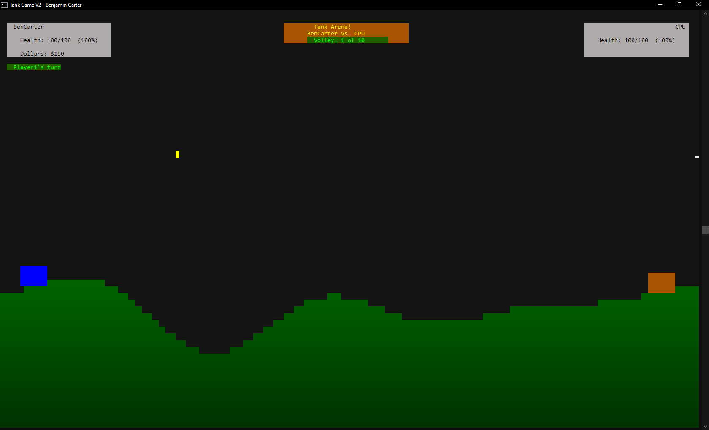

# TankGameV2

By Benjamin Carter - December 14, 2021
CST-210

# A Tank Console-Based Fantasy Fighting Game

---

The graphics use the [Pretty Console system](https://github.com/BenCarter44/PrettyConsole).

## About the game:

In this game, a user can start as a new player or load from existing players. If the user starts as a new player, the player can input a name. 

Once in the game, the user uses a menu to go to the arena or the shop. 

The premise of this game is to grow in strength through upgrades of the user's tank. Eventually, the user's tank will be powerful enough to defeat the enemy tank.
The user can earn money by scoring damage against the opponent in the arena. If the user wins the match (defined by who gave the most damage to the other player in 10 rounds), then the user also wins money proportional to the amount of damage scored.

The user can visit the store to buy new weapons or to add additional weapons to the current stash of weapons. 

Finally, the user can save their progress so the game can remember where they were the last time.

As for the implementation:

The GameContainer class contains the core components of the game. 
The Player, HumanPlayer, and CPUPlayer class "family" holds all the information for each player in the game. Each game holds two players. The one that starts on the left and the one that starts on the right.

The Ground, Weapon, and Tank class all describe different objects in the game.

The Stash class contains a weapon and the count. A player has a vector list of stashes of different weapons.

## Helper classes:

    WindowScaler scales all the visual components so that the game works on different screen sizes

	KeyboardListener receives keyboard inputs from the user. Currently, this only works on WINDOWS platforms and is not cross platform

	FileSaver stores all information from the players into a file

	PStruct is a struct-like class for holding x and y points.

	Stack is a general vector-like class implementing a last-in first-out stack. 

## To Build:

Use `cmake`

Example: `cmake -S . -B build` and then `msbuild TankGame.sln` inside the `build` directory.
Currently works on Windows only. 
Will need to port the keyboard listener to use the new keyboard functions from PrettyConsole that are cross-platform, as then it will work on Linux as well.

## References:

	ASCII ART:
	   https://textkool.com/en/ascii-art-generator?hl=default&vl=default&font=Big&text=Tank%20Game%20V2%0A

	Stack.h
	   Listing 12.7 from Introduction to Programming with C++   Y. Daniel Liang    -- course textbook for CST-210

